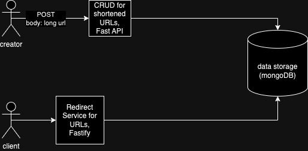
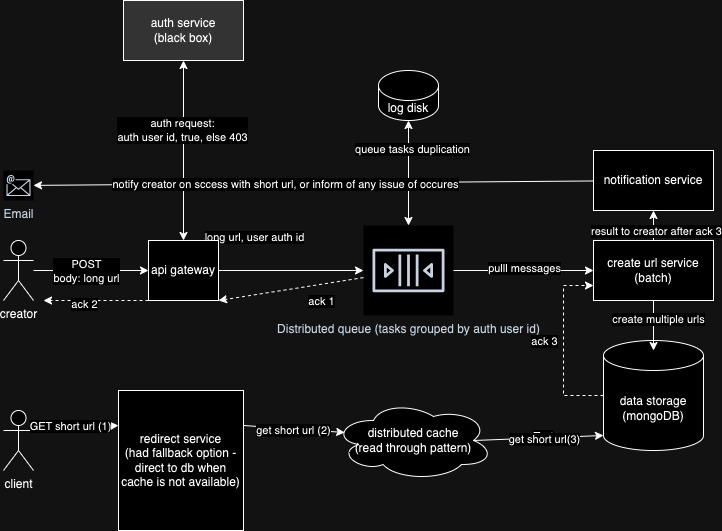

# Nanolink

Nanolink is a URL shortening service that provides a simple API to create and manage shortened URLs, as well as a redirect service to handle client requests.

## Repository

[GitHub Repository](https://github.com/aluppol/nanolink)

## Current Design



### Overview

The current design consists of two main components:

1. **CRUD for Shortened URLs**:
   - Implemented using FastAPI.
   - Handles the creation, retrieval, update, and deletion of shortened URLs.
   - Interacts with MongoDB for data storage.

2. **Redirect Service**:
   - Implemented using Fastify.
   - Redirects clients to the original URL based on the shortened URL.

### Components

- **Creator**: User who sends a POST request to create a shortened URL.
- **Client**: User who sends a GET request to retrieve the original URL.
- **Data Storage**: MongoDB database to store URL mappings.
- **CRUD API**: FastAPI-based service to handle URL management.
- **Redirect Service**: Fastify-based service to handle URL redirections.

## Final Design



### Overview

The final design improves the scalability and reliability of the system by introducing additional components and refining the existing ones.

### Components

1. **Auth Service**:
   - Authenticates users based on their user ID.
   - Returns a 403 status if authentication fails.

2. **API Gateway**:
   - Receives the POST request from the creator.
   - Sends an authentication request to the Auth Service.
   - Queues the task and acknowledges the creator.

3. **Distributed Queue**:
   - Groups tasks by user ID.
   - Pulls messages for processing URL creation.

4. **Create URL Service**:
   - Batch processes URL creation tasks.
   - Stores the results in MongoDB.

5. **Notification Service**:
   - Notifies the creator about the success or failure of URL creation.

6. **Log Disk**:
   - Logs task duplication for reliability.

7. **Distributed Cache**:
   - Caches shortened URLs using a read-through pattern.
   - Falls back to the database if the cache is unavailable.

8. **Redirect Service**:
   - Fetches the shortened URL from the distributed cache.
   - Falls back to MongoDB if the cache is unavailable.

### Flow

1. **Creator Flow**:
   - Sends a POST request to the API Gateway with the long URL.
   - The API Gateway authenticates the user and queues the task.
   - The Distributed Queue processes the task and the Create URL Service creates the shortened URL.
   - The Notification Service informs the creator of the result.

2. **Client Flow**:
   - Sends a GET request to the Redirect Service with the short URL.
   - The Redirect Service fetches the original URL from the distributed cache.
   - If the cache is unavailable, it falls back to MongoDB.

## How to Run
   ```bash
   git clone https://github.com/aluppol/nanolink.git
   cd nanolink
   set -a; source .env; set +a
   docker compose up
   ```

## Access the API

- Use the provided API endpoints to create and manage shortened URLs.
- Use the redirect endpoint to test URL redirection.

## License

This project is licensed under the GNU Affero General Public License v3.0.

## Contributing

Feel free to fork the repository and submit pull requests. For major changes, please open an issue to discuss what you would like to change.

## Contact

For any inquiries, please contact [albert.y.luppol@gmail.com](mailto:albert.y.luppol@gmail.com).

