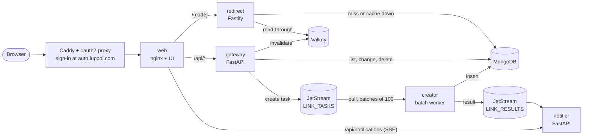

# NanoLink

NanoLink is a URL shortener built as a small distributed system. Link creation is asynchronous: an API gateway queues each request on NATS JetStream, a batch worker creates the links in MongoDB, and a notification service pushes the result to the browser. Clicks take a separate hot path: a Fastify redirect service reads through a Valkey cache and falls back to MongoDB when the cache is down.

Nine hardened containers, all non-root and read-only, run within a 1.25 GB memory budget. Sign-in is Keycloak (OpenID Connect) through oauth2-proxy, and the application still checks every access token itself.

- **Status:** feature-complete and tested locally and in CI. Deployment to `https://nanolink.luppol.com` (demo server, guest login) waits for the server side of the pipeline.
- **Source:** [github.com/aluppol/nanolink](https://github.com/aluppol/nanolink) · License: AGPL-3.0

## Architecture


```mermaid
flowchart LR
    browser([Browser]) --> edge["Caddy + oauth2-proxy<br/>sign-in at auth.luppol.com"]
    edge --> web["web<br/>nginx + UI"]
    web -- "/api/*" --> gateway["gateway<br/>FastAPI"]
    web -- "/api/notifications (SSE)" --> notifier["notifier<br/>FastAPI"]
    web -- "/{code}" --> redirect["redirect<br/>Fastify"]
    gateway -- "create task" --> tasks[("JetStream<br/>LINK_TASKS")]
    tasks -- "pull, batches of 100" --> creator["creator<br/>batch worker"]
    creator -- "insert" --> mongo[("MongoDB")]
    creator -- "result" --> results[("JetStream<br/>LINK_RESULTS")]
    results --> notifier
    gateway -- "list, change, delete" --> mongo
    gateway -- "invalidate" --> cache[("Valkey")]
    redirect -- "read-through" --> cache
    redirect -- "miss or cache down" --> mongo
```

| Service | Built with | Job | Memory limit |
|---|---|---|---|
| `web` | nginx 1.29, TypeScript UI (no framework, esbuild) | the only entry point: serves the UI and routes `/api/*`, the notification stream and short codes | 32 MiB |
| `gateway` | Python 3.12, FastAPI | API gateway: checks the token, validates input, applies the quota, queues creation, manages links, reports tasks | 128 MiB |
| `creator` | Python 3.12 | Create URL service: pulls tasks in batches, inserts links with collision retry, publishes results | 96 MiB |
| `notifier` | Python 3.12, FastAPI | Notification service: pushes results to the creator over Server-Sent Events, and by e-mail when SMTP is configured | 96 MiB |
| `migrate` | Python 3.12 | creates database users, validators, indexes, streams and consumers, then stays up as a readiness marker | 96 MiB |
| `redirect` | TypeScript, Node 24, Fastify 5 | redirect hot path: read-through cache, `302` / `410` / `404` | 128 MiB |
| `mongo` | MongoDB 7.0 | link and task storage (WiredTiger cache capped at 256 MiB) | 448 MiB |
| `queue` | NATS 2.12 JetStream | the distributed queue; its file store is the log disk | 64 MiB |
| `cache` | Valkey 8.1 | 32 MiB LRU cache, no persistence | 48 MiB |

The four Python services are one codebase and one image. Each runs its own entry point, and the code is layered hexagonally: `domain` → `application` → `adapters` → `entrypoints`.

### Creating a link

1. The browser sends `POST /api/links {"long_url": …}`. oauth2-proxy adds the user's Keycloak access token.
2. The gateway validates the token itself (JWKS signature, `iss`, `aud` = `nanolink`, `exp`, token type) and checks the URL. It never fetches the URL; see [Security](#security). Then it counts the request against the daily quota and publishes a task to `links.create.<user id>` with the task id as the JetStream message id, so a retried publish is stored once. JetStream's acknowledgement is **ack 1**; the gateway then answers `202 Accepted` with the task id (**ack 2**).
3. The creator pulls up to 100 tasks at a time. It drops duplicates and reuses the user's existing active link for the same URL. It inserts the rest in one unordered `insert_many`, with timestamps taken from the MongoDB server clock. Unique indexes decide collisions, and a taken short code is retried with a new one. It writes the outcome to the task ledger, which is **ack 3**, and publishes the result. Redelivered tasks are recognised by their task id, so processing is idempotent.
4. The notifier forwards the result to the creator's open `EventSource`, and the new link appears in the UI. `GET /api/tasks/{id}` gives the same answer to clients that poll.

### Serving a click

`GET /{code}` → redirect service → Valkey `link:<code>`:
- On a hit it answers straight away: `302` with the target, `410` for a deleted link, or `404` for an unknown code.
- On a miss it reads MongoDB and caches the answer. Active links are cached for 5 minutes, deleted ones for 1 hour, unknown codes for 30 seconds, which stops floods of unknown codes from reaching the database.
- If Valkey is slow or down (50 ms deadline), it reads MongoDB directly.

Browsers get small HTML error pages; other clients get JSON.

The gateway deletes the cache entry whenever a link changes or is deleted. A redirect that read the old value just before the change can put it back, so a stale target can live at most 5 minutes.

### From the 2024 sketch to what runs

The original design, kept for history: [current design (2024)](docs/iter1.jpg) · [final design sketch (2024)](docs/approximate_final.jpg).

| Sketch | Built as |
|---|---|
| Auth service (black box, 403) | Keycloak realm `luppol` + oauth2-proxy in front; the gateway verifies the access token (401 / 403) |
| API gateway (queue + ack) | `gateway`, JetStream publish acknowledgement → `202` |
| Distributed queue, tasks grouped by user id | NATS JetStream stream `LINK_TASKS`, subjects `links.create.<user id>` |
| Log disk (task duplication) | JetStream file store on a volume; tasks are kept for 7 days |
| Create URL service (batch) | `creator`, pull consumer, batches of 100 |
| Notification service (e-mail) | `notifier`: live SSE to the UI, e-mail through an SMTP adapter |
| Distributed cache (read-through, DB fallback) | Valkey, read-through decorator in the redirect service, 50 ms deadline, MongoDB fallback |
| Redirect service | `redirect` (Fastify) |

**Re-scoped to fit 1.25 GB on a shared 8 GB server:**
- NATS JetStream (≈10 MiB) replaces three Kafka brokers, and one Valkey node replaces a Redis cluster.
- Every stateful service is a single node. Replication is configuration (`num_replicas`, cluster mode), not code.
- Tracing (Jaeger) is left out in favour of structured logs.

## Run it locally

Requirements: Docker with Compose ≥ 2.24, `openssl`.

```bash
dev/up.sh        # builds the five images, generates throwaway secrets, starts the stack
open http://127.0.0.1:8088
dev/down.sh      # stops it; add --volumes to drop the data
```

Locally, a small development proxy (`dev/identity/proxy.py`) plays the part of oauth2-proxy and Keycloak. It signs short-lived tokens with its own key and lets you sign in as `alice`, `bob` (users), `admin` or `guest`. The services run exactly the production `deploy/compose.yaml`; only the token issuer, the public URL and the published port differ (`dev/compose.yaml`).

```bash
docker run --rm -i --network nanolink_back nanolink/backend:dev python - < dev/e2e.py
```
This end-to-end check signs in, creates a link through the queue and waits for the pushed result, follows the redirect, re-points and deletes the link, and checks owner isolation, the admin view, the guest sandbox and the input rules.

## API

All `/api` routes need the access token (`X-Forwarded-Access-Token`, set by oauth2-proxy); short-code redirects do not. Errors are `{"error": code, "message": text}`.

| Route | Answer |
|---|---|
| `GET /api/me` | who you are, your roles, today's quota |
| `POST /api/links {long_url}` | `202 {task_id, status: "queued"}` + `Location: /api/tasks/{id}`; `422 invalid_long_url`, `429 quota_exceeded` |
| `GET /api/tasks/{task_id}` | `{task_id, status: queued\|created\|failed, link, failure}` |
| `GET /api/links?cursor=&limit=` | your active links, newest first, `{links, next_cursor}` |
| `GET` / `PATCH {long_url}` / `DELETE /api/links/{id}` | one of your links; `409 duplicate_long_url` when you already have that target |
| `GET /api/admin/links`, `DELETE /api/admin/links/{id}` | moderation, role `ADMIN` |
| `GET /api/notifications` | Server-Sent Events, event `link-result` |
| `GET /{code}` | `302` to the target, `410` deleted, `404` unknown |

The OpenAPI document is served at `/api/openapi.json`.

## Security

- **Tokens:** oauth2-proxy handles the login. The gateway and the notifier still verify every access token themselves: RS256 only, JWKS signature, `iss`, `aud` containing `nanolink`, `exp`, and `typ` = `Bearer`, so an ID token is refused. Roles come from `realm_access.roles`. Tests cover forged, expired, foreign-audience, algorithm-confusion (HS256 signed with the public key) and unsigned tokens.
- **Object-level checks:** every link and task query is scoped to the caller. The guest role works in a shared sandbox that a nightly `demo-reset` wipes and reseeds. Moderation needs `ADMIN`.
- **No server-side requests to user URLs:** NanoLink never fetches a submitted address, so there is no SSRF surface. It still refuses destinations that point into private space: non-http(s) schemes, embedded credentials, loopback, private, link-local and CGNAT addresses (including `169.254.169.254` and IPv4-mapped IPv6), numeric host forms such as `2130706433` or `0x7f.1`, single-label hosts, and internal top-level domains.
- **Least privilege in the data layer:** the MongoDB users are `gateway` and `creator` (readWrite) and `redirect` (read only). A JSON-schema validator guards the `links` collection.
- **Containers:** `cap_drop: [ALL]`, `no-new-privileges`, read-only root filesystems with a small `/tmp`, non-root users, memory and PID limits. The data and service networks are `internal` and have no route out. Of the application services only the gateway and the notifier also join a network with egress, for JWKS and SMTP; `web` joins the network the server's login gateway provides.
- **Dependencies:** Python locked with hashes (`pip-audit`: 0), npm lockfiles (`npm audit`: 0), base images pinned by digest.

## Tests and quality gates

| Part | Checks | Tests |
|---|---|---|
| `services/backend` | `ruff` (lint + format), `mypy --strict`, house-rule check (no comments or docstrings, functions ≤ 30 lines), `pip-audit` | 42 contract tests (each unit a `CASES` table) + 12 integration tests against real MongoDB, NATS and Valkey |
| `services/redirect` | Biome, `tsc` strict, comment check, `npm audit` | 17 contract tests (Fastify `inject` with in-memory ports) |
| `services/web` | Biome, `tsc` strict, comment check, `npm audit` | 16 contract tests of the UI model; nginx `-t` at image build |
| whole stack | `deploy/smoke.sh`: 12 HTTP checks against the production compose file; `dev/e2e.py`: the signed-in flows | CI jobs `stack` and `e2e` |

CI (`.github/workflows/ci.yml`) runs all of this on every push to `dev`, builds the five images, and brings the production compose file up with `--wait`. `main` is the deploy branch: a green `dev` commit pushed to it is deployed to the demo server by `.github/workflows/deploy.yml`.

## Benchmark

`bench/redirect.sh` runs [autocannon](https://github.com/mcollina/autocannon) inside a container on the stack's network. By default it targets `web:8080/Albert`, a seeded link, which takes the same path as production minus Caddy and oauth2-proxy: nginx → redirect → Valkey. It warms up for 5 s, then runs 30 s at each of 1, 10, 50 and 100 connections. Every answer is a `302`.

| Connections | Requests | Req/s | p50 | p90 | p99 | max |
|---|---|---|---|---|---|---|
| 1 | 10,974 | 366 | 15 ms | 29 ms | 49 ms | 75 ms |
| 10 | 30,207 | 1,007 | 18 ms | 31 ms | 56 ms | 441 ms |
| 50 | 26,927 | 898 | 38 ms | 87 ms | 370 ms | 1,435 ms |
| 100 | 22,182 | 739 | 78 ms | 333 ms | 546 ms | 1,474 ms |

**Where it ran:** a 2019 MacBook Pro (Intel i9-9980HK, 8 cores) under Docker Desktop, 2026-09-24. The laptop was shared with other build and test workloads (load average ≈ 70), so read these numbers as a floor, not a capacity figure. On the same run, nginx answered its static `/healthz` at only ≈ 2.4–3.5k req/s. The numbers for the demo server will come from the same script, run there.

## Repository

```
services/backend    Python: domain, application, adapters (MongoDB, NATS, Valkey, OIDC, SMTP), entrypoints
services/redirect   TypeScript: redirect service
services/web        nginx config, UI source, demo-reset command
services/queue      NATS JetStream configuration
services/cache      Valkey start script
deploy/             production compose file, image list, secret names, smoke checks
dev/                local override, development sign-in proxy, end-to-end check
bench/              redirect benchmark
.github/workflows   ci.yml (dev), deploy.yml (main → demo server)
```

## License

GNU Affero General Public License v3.0. Contact: [albert.y.luppol@gmail.com](mailto:albert.y.luppol@gmail.com).
